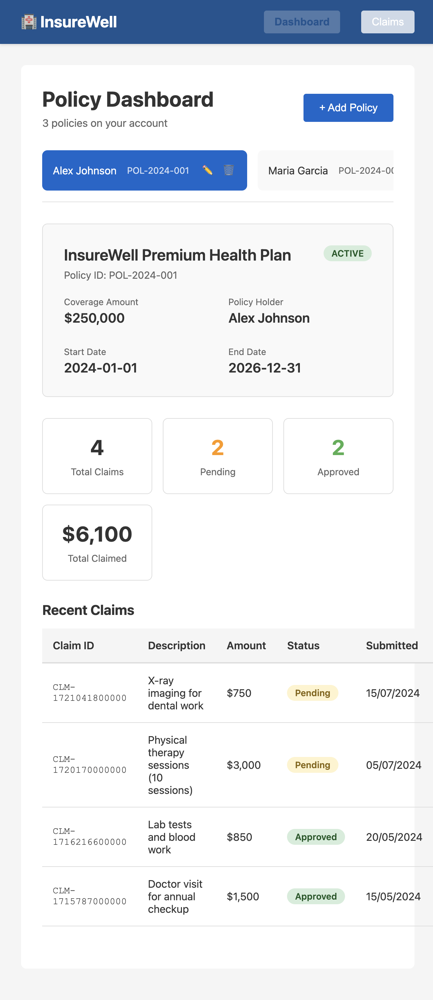

# InsureWell

A lightweight health insurance management system built with a **React** frontend and a **Java Spring Boot** backend.

---

## Features (Phase 1 MVP)

- **Policy Dashboard** — view policy details (ID, plan name, coverage amount, status, dates) with per-policy stats and recent claims
- **Multi-policy support** — clickable tabs to switch between policies without a page reload
- **Claims Module** — submit claims (amount, description, optional file upload), filter by policy, and track status (Pending / Approved / Rejected)
- **Authentication and RBAC** — policyholder/admin login with role-based data access and actions
- **REST API** — JSON endpoints for policy and claim operations
- **Seeded sample data** — H2-backed backend starts with sample policies and claims for local development

---

## Screenshots

### Dashboard


### Claims



---

## Project Structure

```
InsureWell/
├── src/
│   ├── backend/            # Spring Boot API, entities, repositories, seed data
│   ├── frontend/           # React UI
│   ├── run.sh              # Starts backend and frontend together
│   └── README.md           # Short source-tree note
├── docs/                   # Architecture and data model docs
├── handbook/               # Workflow and setup guides
├── images/                 # Supporting images and demo assets
└── README.md
```

---

## Prerequisites

- Java 17+
- Maven 3.9+
- Node.js 18+
- npm 9+

---

## Setup

```bash
# 1. Clone the repository
git clone <repo-url>
cd insure-well-agentic-sdlc-ghe

# 2. Start the backend and frontend
cd src
chmod +x run.sh
./run.sh
```

Open **http://localhost:3000** in your browser.

The backend API runs on **http://localhost:8080/api** and is seeded with sample policies and claims on startup. The script installs frontend dependencies automatically if `node_modules` is missing.

---

## Documentation Map

- Root [README.md](README.md): overview, quick start, and repository layout
- Source tree [src/README.md](src/README.md): architecture, detailed backend/frontend commands, API reference, sample data, and development notes
- Architecture docs [docs/InsureWell_HLD.md](docs/InsureWell_HLD.md) and [docs/InsureWell_DataModel.md](docs/InsureWell_DataModel.md): system design and data model
- Workflow guides under [handbook](handbook): setup and demo flow material

---

## Future Phases

The codebase is intentionally modular — new routes, templates, and data fields can be added without restructuring:

| Phase | Feature |
|-------|---------|
| 2 | Doctor / hospital provider search |
| 3 | Payment integration |
| 4 | Email / SMS notifications |
| 5 | Family member management |
| 6 | Admin panel with claim adjudication |
