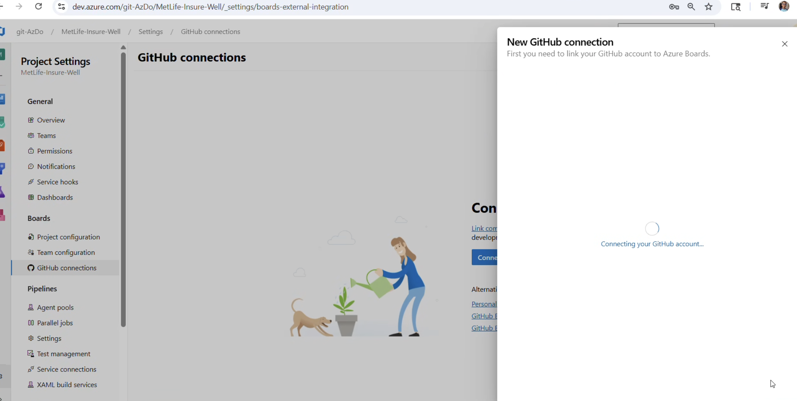
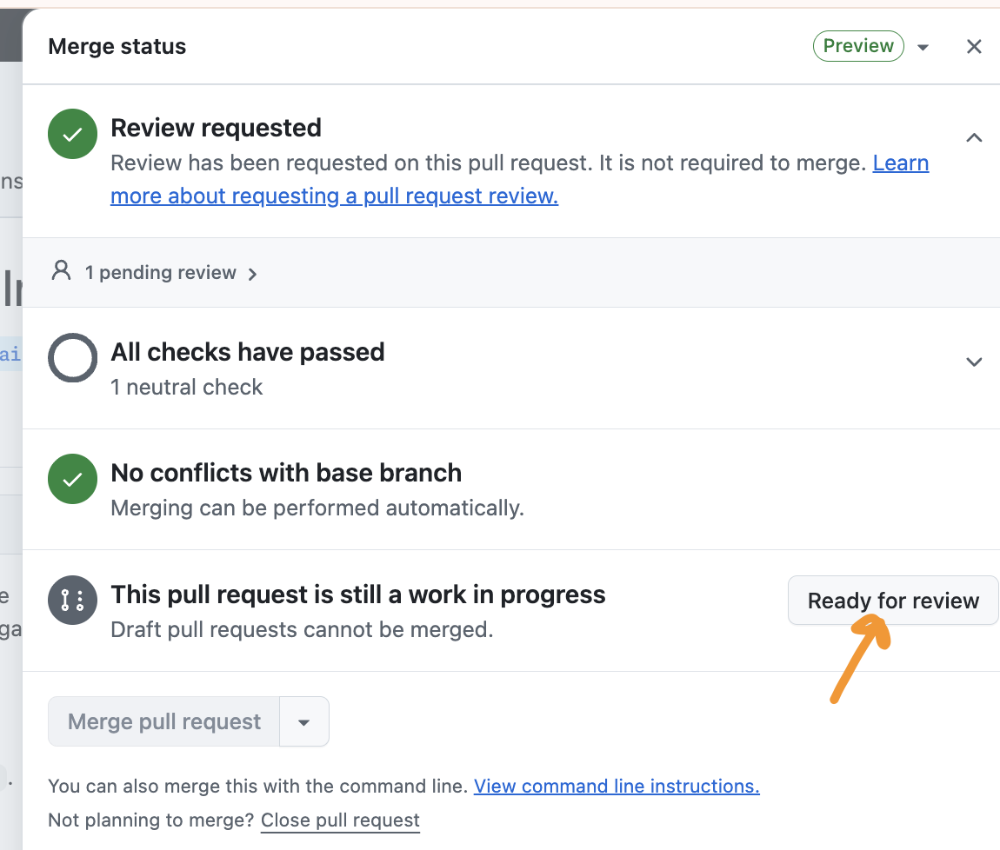
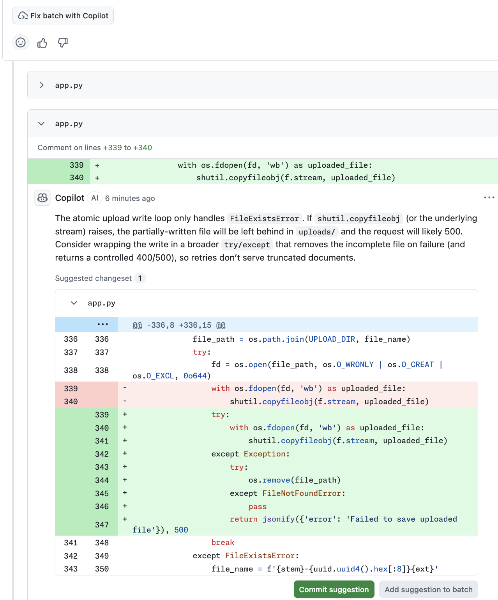

# 🚀 Agentic SDLC Workflow Flow

## Step-by-Step Visual Guide

### 1️⃣ Request Flow Setup

Initial workflow request initiated from issue → agent processes → code generation

### 2️⃣ Service Connection

Secure connection established between GHE and Azure DevOps for pipeline integration

### 3️⃣ Copilot Code Review Initial

Copilot begins automated code review on generated code

### 4️⃣ Status Checks

CI/CD pipeline runs automated checks and validations

### 5️⃣ Automatic Code Review

Full automated code review with detailed feedback

### 6️⃣ Link GitHub Account to ADO

Authentication & account linking between GitHub and Azure DevOps

### 7️⃣ Draft Pull Request

PR created in draft state, ready for review

### 8️⃣ Ready for Review

PR marked ready for human review and approval

### 9️⃣ Fix Batch with Copilot

Copilot generates batch fixes for identified issues

### 🔟 Commit Suggestion

Copilot suggests commit message and changes

### 1️⃣1️⃣ @copilot Delegate

Developer delegates task: `@copilot apply fixes`

### 1️⃣2️⃣ Fix and Commit

Copilot automatically applies fixes and commits changes

### 1️⃣3️⃣ @copilot Working

Copilot processing and finalizing all requested changes

---

## 🎯 Key Outcomes

✅ Automated issue-to-PR workflow  
✅ Continuous code review feedback  
✅ Self-fixing capabilities via Copilot delegation  
✅ Seamless integration with Azure DevOps pipelines  
✅ Reduced manual review cycles

