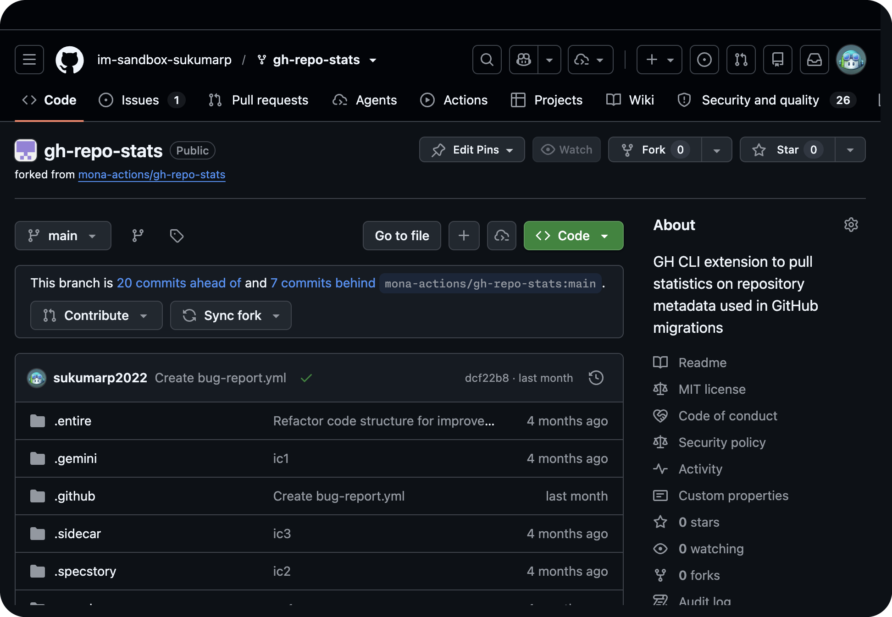
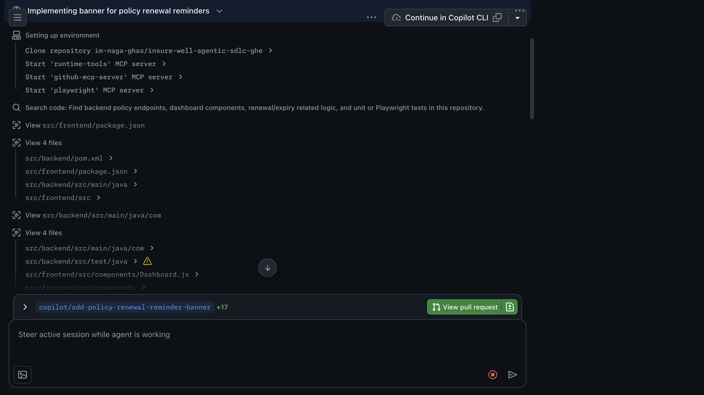
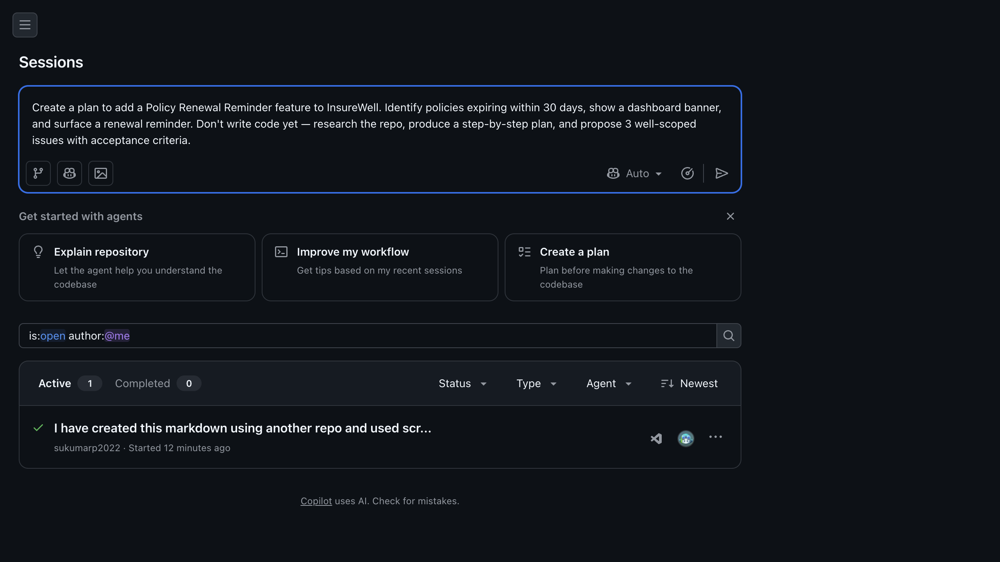
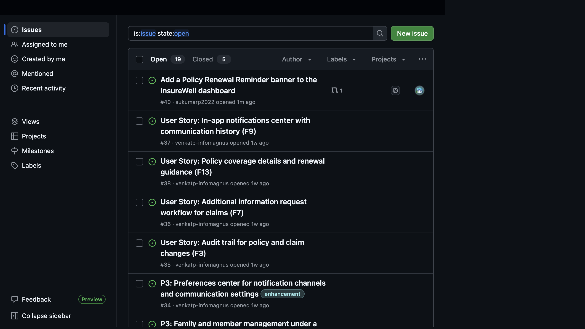
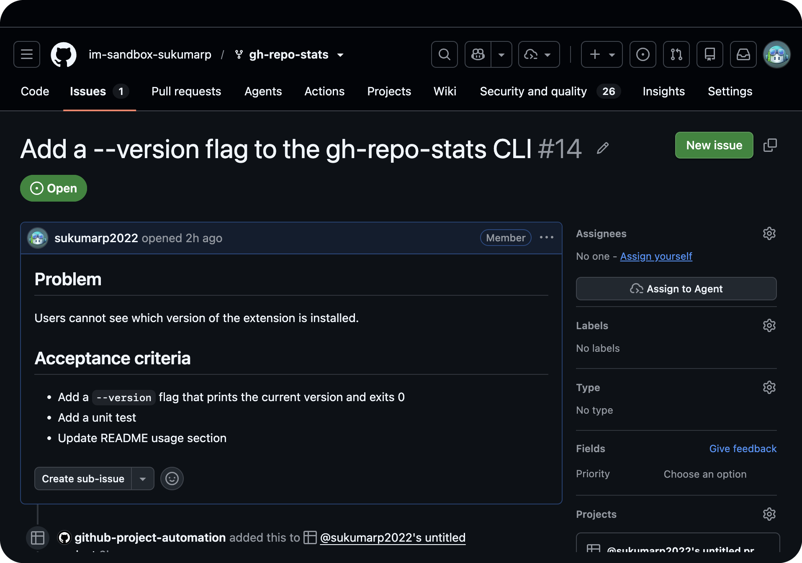
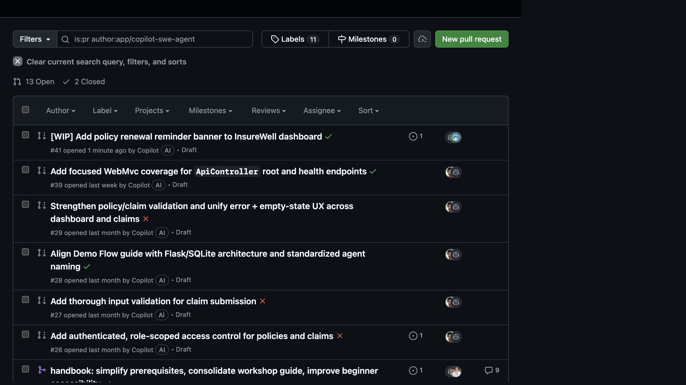
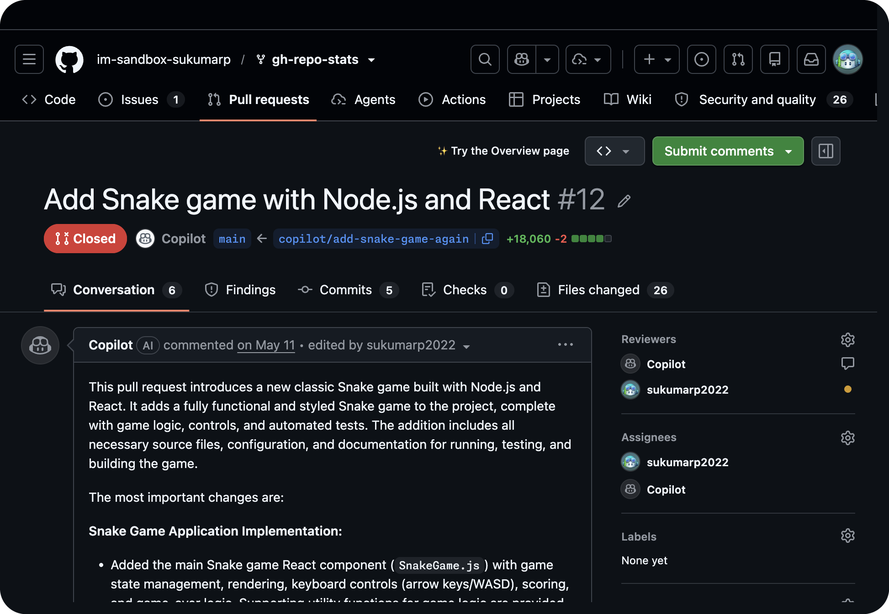
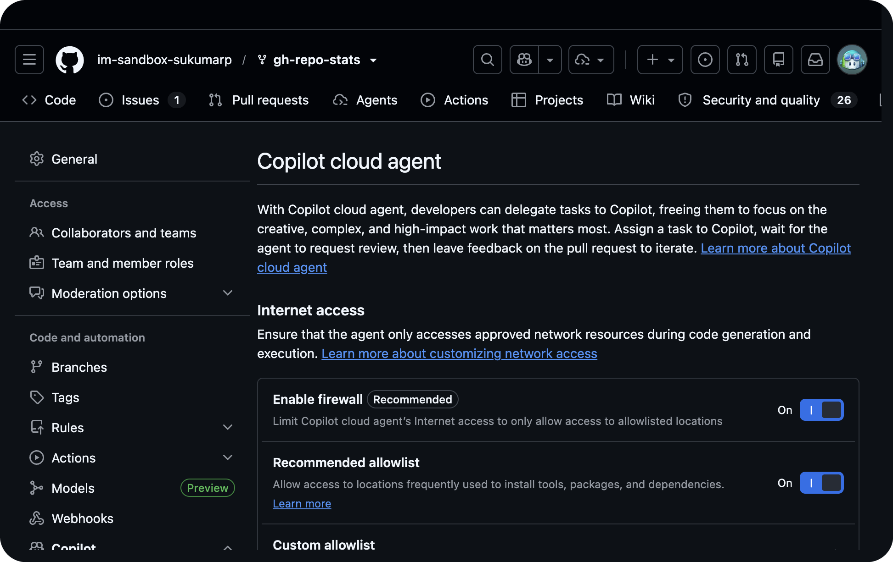

# GitHub Copilot Cloud Agent — Hands-On Workshop

> A complete, guided workshop on the **GitHub Copilot cloud agent** (also called the *coding agent*): what it is, how it differs from other Copilot agents, how to trigger, customize, run, and steer it — with step-by-step instructions and screenshots from a live demo repository. Everything in this workshop runs on **github.com**: first **create a plan**, then **create issues**, then **assign them to Copilot**.

**Demo repository used for screenshots:** [`im-naga-ghas/insure-well-agentic-sdlc-ghe`](https://github.com/im-naga-ghas/insure-well-agentic-sdlc-ghe)
**Audience:** Developers, team leads, and platform admins
**Format:** Hands-on, follow-along
**Last verified:** June 2026

---

## Index

1. [What is the Copilot Cloud Agent?](#1-what-is-the-copilot-cloud-agent)
2. [How it differs from other Copilot agents](#2-how-it-differs-from-other-copilot-agents)
3. [Prerequisites &amp; access](#3-prerequisites--access)
4. [Where it runs (the development environment)](#4-where-it-runs-the-development-environment)
5. [How to trigger it](#5-how-to-trigger-it)
   - [5.1 Assign an issue](#51-assign-an-issue)
   - [5.2 The Agents dashboard — create a plan](#52-the-agents-dashboard--create-a-plan)
   - [5.3 Other entry points](#53-other-entry-points)
6. [Watching the agent work: sessions &amp; PRs](#6-watching-the-agent-work-sessions--prs)
7. [How to customize it](#7-how-to-customize-it)
   - [7.1 Custom instructions](#71-custom-instructions)
   - [7.2 Pre-install dependencies (copilot-setup-steps.yml)](#72-pre-install-dependencies-copilot-setup-stepsyml)
   - [7.3 MCP servers](#73-mcp-servers)
   - [7.4 Custom agents, hooks, skills](#74-custom-agents-hooks-skills)
   - [7.5 Secrets, firewall &amp; runners](#75-secrets-firewall--runners)
8. [How to steer it (get the best results)](#8-how-to-steer-it-get-the-best-results)
9. [Limitations &amp; cost](#9-limitations--cost)
10. [Workshop labs](#10-workshop-labs)
11. [Quick reference](#11-quick-reference)

---

## 1. What is the Copilot Cloud Agent?

The **Copilot cloud agent** is an autonomous coding agent that works **independently in the background** on GitHub — just like a human teammate. You delegate a task; it researches the repo, plans, writes code on a branch, runs tests, and opens a pull request.

It can:

- Research a repository and explain how it works
- Create implementation plans
- Fix bugs and implement incremental features
- Improve test coverage and documentation
- Address technical debt and resolve merge conflicts

All work happens **on GitHub** with full transparency — every step is a commit, viewable in session logs.


*The demo repo `insure-well-agentic-sdlc-ghe` (React + Spring Boot insurance app), with the **Agents** tab in the repository navigation.*

---

## 2. How it differs from other Copilot agents

|                  | **Cloud agent** (this workshop) | **Agent mode (IDE)** | **Copilot Chat** |
| ---------------- | ------------------------------------- | -------------------------- | ---------------------- |
| Where it runs    | GitHub-hosted ephemeral env (Actions) | Your local IDE             | IDE / GitHub.com       |
| Autonomy         | Fully background, async               | Interactive, supervised    | Q&A + inline edits     |
| Output           | Branch + pull request                 | Local file edits           | Suggestions/answers    |
| Branch/commit/PR | Automated                             | You do it                  | You do it              |
| Best for         | Delegating whole tasks                | Pair-programming           | Quick help             |

Key distinction: cloud agent works **autonomously on GitHub** and opens a PR; **agent mode** edits your local workspace synchronously. Cloud agent automates branch creation, commit messages, pushing, and PR description — you review when ready.

---

## 3. Prerequisites & access

- A **paid Copilot plan** (Pro, Pro+, Max, Business, Enterprise).
- For Business/Enterprise, an admin enables the **Copilot cloud agent** policy.
- Repository owners can opt repos in/out.
- Repo settings page: **Settings → Copilot → Cloud agent**.
- **Permissions:** you need write access to assign Copilot, create issues/PRs, and add workflows (admin for settings). For the workshop, **fork the demo repo** (`insure-well-agentic-sdlc-ghe`) to your own account so you have admin rights.
- **Time:** ~60–90 min. **Outcome:** trigger, customize, steer, and merge a Copilot PR.

---

## 4. Where it runs (the development environment)

The agent gets its **own ephemeral development environment powered by GitHub Actions**. There it clones your code, installs dependencies, builds, runs tests and linters.

- **Default OS:** Ubuntu x64 Linux (Windows supported on self-hosted/larger runners)
- **Max session time:** **59 minutes** (hard limit)
- **Network:** integrated firewall on by default (allowlist-based)
- One repo, one branch, one PR per task

The session log shows the environment boot, firewall, repo clone, and MCP servers:


*A completed session: model used, AI credits, "Setting up environment", agent firewall, repo clone, and the default MCP servers.*

---

## 5. How to trigger it

### 5.1 The Agents dashboard — create a issue

Repository **Agents** tab → type a task in *"Give Copilot a background task to work on"*, pick a model, and send. Starter cards: **Explain repository**, **Improve my workflow**, **Create a plan**. Start by asking Copilot to **create a plan** and propose issues before any code is written.
Use below prompt to create a plan for a new feature:

```
Create github issues to add a Policy Renewal Reminder feature to InsureWell. Don't write code yet — research the repo, produce a step-by-step plan, and propose 1 well-scoped issues with acceptance criteria.
```



Select `Create or update Issue/pull request in this session`. Post selection, Copilot will research the repo, create a plan, and propose issues. You can review the plan in the session log.

### 5.2 Assign an issue

The classic entry point — write a well-scoped issue and hand it to Copilot.

1. The issue shows up in the repo backlog alongside your planned features.

   
2. Open the issue and, in the sidebar, choose **Assign to Agent** (or add **Copilot** as the assignee).

   
3. Copilot starts a background session and later opens a PR.

4. You can view the session log to see how Copilot researched, planned, and implemented the feature.

5. Steer the session by leaving `Generate pdf documentation with changes along UI screens`

#### 5.2.1. How to steer it (get the best results)

- **Well-scoped tasks:** clear problem, acceptance criteria, affected files.
- **Research → plan → iterate** before opening a PR.
- **Iterate via review comments**; batch with **Start a review**; only write-access users are honored.
- **Pick the model** at task start.
- Hand off complex/ambiguous/security-critical work to humans; give Copilot bugs, tests, docs, tech debt.

### 5.3 Other entry points

- **Copilot Chat** on GitHub.com (carries chat context into the session)
- **`@copilot`** in a PR comment, **failing Actions runs**, **security campaigns**, and **automations** (scheduled/event-driven)

---

## 6. Watching the agent work: sessions & PRs

Depending on the entry point, Copilot either opens a draft PR right away (e.g., issue assignment) or researches/plans/makes branch changes first and lets you create the PR when ready (GitHub.com Agents tab/Chat). Integrations like Jira, Slack, Teams, Azure Boards, and Linear create a PR directly.


*Pull requests authored by Copilot in the demo repo.*


*A Copilot PR with its "Initial plan", task checklist, and a **View session** link.*

Use **View session** to see step-by-step logs (see §4). Iterate by leaving review comments and mentioning `@copilot`; batch them via **Start a review**.


## 7. How to customize it

### 7.1 Custom instructions

Supported files: `.github/copilot-instructions.md`, `.github/instructions/**/*.instructions.md`, `**/AGENTS.md`, `CLAUDE.md`, `GEMINI.md`. Org-wide instructions are also honored (repo-level takes priority).

### 7.2 MCP servers

GitHub + Playwright MCP are enabled by default; add your own under **Settings → Copilot → MCP servers**. Firewall, policies, validation tools, and MCP config live here:



### 7.3 Custom agents, hooks, skills

- **Custom agents** — specialized profiles (e.g., frontend, docs, testing) with scoped tools.
- **Hooks** — run shell commands at key points (validation, logging, scanning).
- **Skills** — instructions/scripts/resources for specialized tasks.

---

## 8. Limitations & cost

- One repo, one branch, one PR per task; **59-min** cap.
- Doesn't honor content exclusions; GitHub-hosted repos only.
- Incompatible rulesets block it (add Copilot as bypass actor).
- Uses **GitHub Actions minutes + AI credits**.

---

## 9. Workshop labs

1. **Plan:** on the **Agents** tab, ask Copilot to *create a plan* for a feature and propose issues; review the plan in the session.
2. **Trigger:** create a well-scoped issue (use the template below), **Assign to Agent**, then open the session log to inspect the model's reasoning and tool choices.
3. **Customize:** add the sample `copilot-instructions.md` merge to default.
4. **Steer:** review the PR, `@copilot` a change, merge.
5. **Extend:** add an MCP server; create a testing custom agent.

**Issue template (copy-paste):**

```
Add a Policy Renewal Reminder banner to the InsureWell dashboard.
## Acceptance criteria
- Backend endpoint returns policies expiring within 30 days
- Dashboard shows a dismissible renewal reminder banner that links to the policy
- Add unit + Playwright tests
- Update README usage
```

**Sample `.github/copilot-instructions.md`:**

```markdown
This is InsureWell: a React frontend and a Spring Boot (Java 17/Maven) backend.
- Backend: `cd src/backend && mvn test`  Frontend: `cd src/frontend && npm test`
- Match existing style; add Playwright e2e tests for UI; update README for new endpoints/screens.
```

---

## 10. Quick reference

| Want to…        | Do this                                       |
| ---------------- | --------------------------------------------- |
| Start a task     | Assign issue / Agents tab / Chat / IDE / CLI  |
| Pre-install deps | `copilot-setup-steps.yml`                   |
| Guide behavior   | `copilot-instructions.md`, custom agents    |
| Add tools        | MCP servers                                   |
| Control network  | Settings → Copilot → Cloud agent (firewall) |
| Iterate          | `@copilot` in PR review                     |
